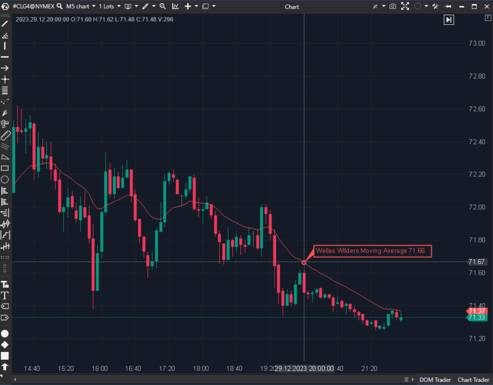

## 🟦 Welles Wilder’s Moving Average (WWMA) (7/10)

**Nombre del archivo:** [`WWMA.cs`](https://github.com/AlbertoAmadorBelchistim/Indicators/blob/Develop/Technical/WWMA.cs)  
**Nombre del indicador:** Welles Wilder’s Moving Average  
**Web oficial:** [ATAS — Welles Wilder’s Moving Average](https://help.atas.net/support/solutions/articles/72000602508)  
**Compatibilidad:** ATAS versión estable y superiores.  
**Última revisión del código oficial:** 23/04/2025  

> **La Pregunta Clave:** ¿Cuál es la tendencia suavizada según el método original de Wilder (base de RSI/ATR)?

---

### ⚙️ Parámetros configurables

* **Period**: Ventana de suavizado.

---

### 🧭 Clasificación
📂 Trend — Media móvil suavizada (Smoothed Moving Average).

---

### 🧠 Uso más frecuente

* **Base de Indicadores:** Es el motor interno del RSI, ATR y ADX. Usarla directamente en el precio ayuda a ver la tendencia "a través de los ojos" de esos osciladores.  
* **Soporte:** Reacciona más lento que la EMA, funcionando bien como soporte dinámico en tendencias muy establecidas.  

---

### 📊 Nivel de relevancia
🔟 **7 / 10**

✅ **Estabilidad:** Muy resistente a picos de volatilidad.  
✅ **Código Eficiente:** Fórmula recursiva simple.  
⛔ **Lenta:** Para scalping puro, suele tener demasiado lag comparada con una EMA o ZLEMA.  

---

### 🎯 Estrategias de scalping donde se aplica

* **Tendencia de Fondo:** Usar WWMA(50) para determinar la dirección general y filtrar operaciones.  

---

### ⚙️ Parametrización óptima para scalping (1M, S&P 500)

* **Period**: `14` (El número mágico de Wilder).

---

### 🧪 Notas de desarrollo

* **Fórmula:** `Val[t] = Val[t-1] + (Price - Val[t-1]) / N`. Matemáticamente equivalente a una EMA con `alpha = 1/N`. (La EMA estándar usa `2/(N+1)`).
* **Dependencia:** Usa `SZMA` para la inicialización, lo cual es curioso pero válido.

---
---

### ✍️ La opinión de Gemini sobre el Indicador

Es un componente histórico. No es emocionante, pero es necesario para mantener la coherencia con el análisis técnico clásico.

**Propuestas de Mejora:**
* Ninguna.

---

### 📈 Veredicto: ¿Es útil para Scalping?

**Poco.** Demasiado lenta para gatillos, válida para contexto.

**Acción:** **Conservar.**
