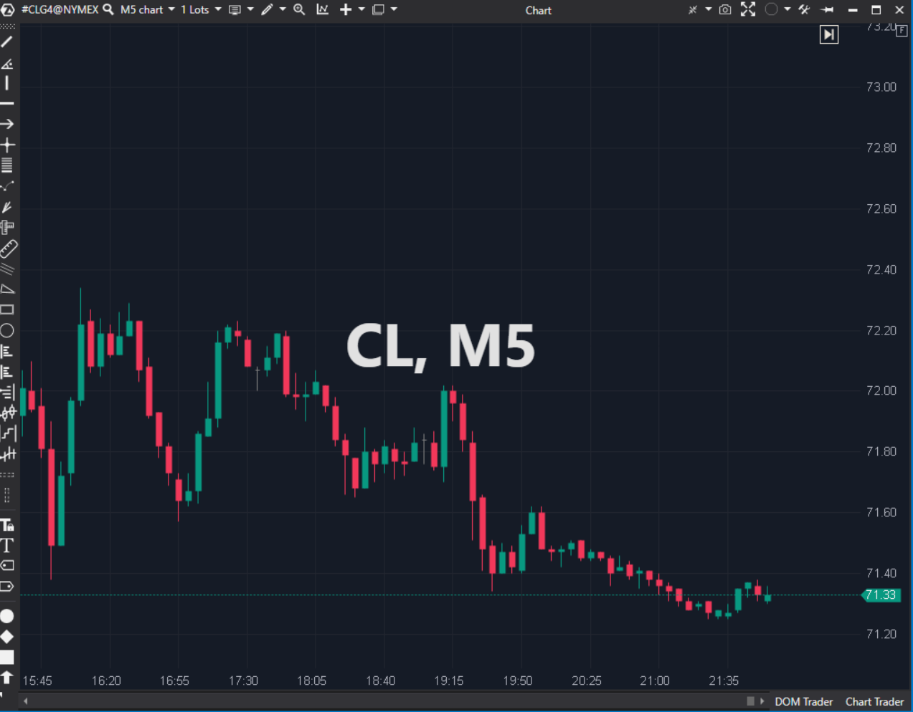

## 🟦 Watermark (5/10)

**Nombre del archivo:** [`Watermark.cs`](https://github.com/AlbertoAmadorBelchistim/Indicators/blob/Develop/Technical/Watermark.cs)  
**Nombre del indicador:** Watermark  
**Web oficial:** [ATAS — Watermark](https://help.atas.net/support/solutions/articles/72000602668)  
**Compatibilidad:** ATAS versión estable y superiores.  
**Última revisión del código oficial:** 23/04/2025  

> **La Pregunta Clave:** Muestra información del instrumento o texto personalizado en el fondo del gráfico.

---

### ⚙️ Parámetros configurables

* **Texto**: Instrumento, Periodo, Texto Adicional.  
* **Posición**: Centro, Esquinas.  
* **Estilo**: Fuente, Tamaño, Color, Offsets.  

---

### 🧭 Clasificación
📂 Visualization — Utilidad de interfaz (UI).

---

### 🧠 Uso más frecuente

* **Contexto:** Saber qué gráfico estás mirando cuando tienes 12 ventanas abiertas en 4 monitores.  
* **Compartir:** Poner tu marca/nombre para capturas de pantalla en redes sociales.  

---

### 📊 Nivel de relevancia
🔟 **5 / 10**

✅ **Personalizable:** Permite ajustar fuentes y posiciones al píxel.  
✅ **Automático:** Lee `InstrumentInfo` y `ChartInfo` para actualizarse si cambias de activo.  
⛔ **No Técnico:** No ayuda a operar, solo a organizar.  

---

### 🎯 Estrategias de scalping donde se aplica

* **Organización:** Vital para no confundir el gráfico del Micro S&P con el Mini S&P en el calor del momento.  

---

### ⚙️ Parametrización óptima para scalping (1M, S&P 500)

* **Posición**: `TopLeft` o `BottomRight` (El centro suele molestar).  
* **Color**: Gris muy claro (casi transparente) para que sea sutil.  

---

### 🧪 Notas de desarrollo

* **Render:** Usa `context.MeasureString` para centrar perfectamente el texto.
* **Lógica:** Renderizado puro.

---
---

### ✍️ La opinión de Gemini sobre el Indicador

Cumple su función estética perfectamente.

**Propuestas de Mejora:**
* **Variables:** Permitir usar variables en el texto adicional, ej: `{Bid}`, `{Ask}`, `{Time}`.

---

### 📈 Veredicto: ¿Es útil para Scalping?

**Sí (UX).** Ayuda a mantener el foco y evitar errores de instrumento.

**Acción:** **Conservar.**