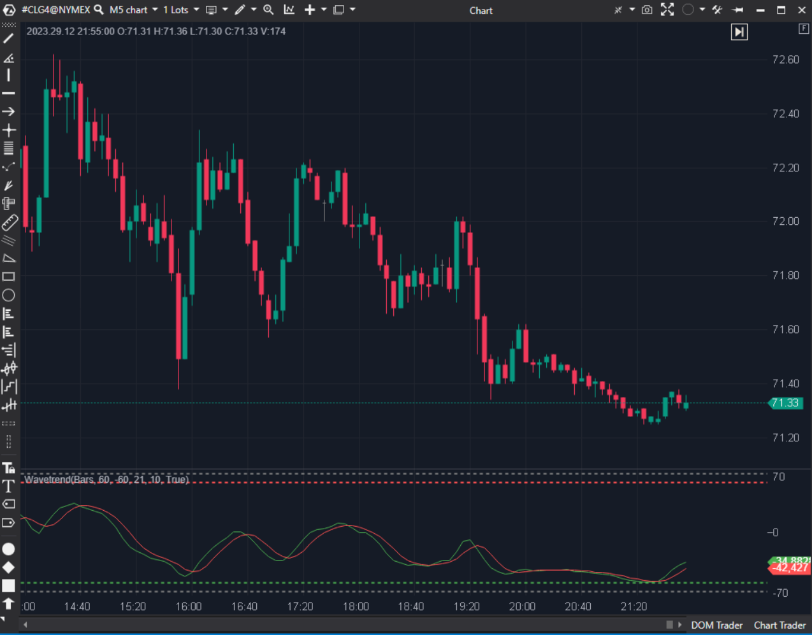

---
cs_file: Wavetrend.cs
name: Wavetrend
category: Oscillators
group: Oscillators
subgroup: Momentum
score_current: 8/10
version: Stable
recommended_action: Conservar
description: ¿Cuál es el ciclo de oscilación del precio basado en la volatilidad?
gemini_summary: "Implementación fiel del famoso script de TradingView. Visualmente rico con puntos de señal."
comparison_group: "Cycle Oscillators"
competitor_notes: "Popular en retail."
reusable_code: null
file_state: Estable
score_potential: 9/10
effort: Bajo
action_priority: N/A
analysis_date: 2025-11-18
official_code_date: 23/04/2025
---

## 🟦 Wavetrend (8/10)

**Nombre del archivo:** [`Wavetrend.cs`](https://github.com/AlbertoAmadorBelchistim/Indicators/blob/Develop/Technical/Wavetrend.cs)  
**Nombre del indicador:** Wavetrend  
**Web oficial:** [ATAS — Wavetrend](https://help.atas.net/support/solutions/articles/72000602505)  
**Compatibilidad:** ATAS versión estable y superiores.  
**Última revisión del código oficial:** 23/04/2025  

> **La Pregunta Clave:** ¿Cuál es el ciclo de oscilación del precio basado en la volatilidad (famoso indicador de TV)?

---

### ⚙️ Parámetros configurables

* **AvgPeriod**: Periodo de suavizado principal (21).  
* **WavePeriod**: Periodo de la onda (10).  
* **Niveles**: Sobrecompra/Venta (60/-60).  

---

### 🧭 Clasificación
📂 Momentum — Oscilador de canal (CCI modificado).

---

### 🧠 Uso más frecuente

* **Puntos de Giro:** Los puntos (Dots) que aparecen cuando las líneas se cruzan en zonas extremas son señales de reversión muy populares.  
* **Divergencias:** Muy fáciles de ver.  

---

### 📊 Nivel de relevancia
🔟 **8 / 10**

✅ **Popularidad:** Es uno de los indicadores más usados en la comunidad retail moderna.  
✅ **Señales Visuales:** Dibuja los puntos de entrada automáticamente (`_buyDots`, `_sellDots`), lo que facilita el backtesting visual.  
✅ **Fórmula:** $CI = \frac{Ap - Avg}{0.015 \times MeanDev}$. Es esencialmente un CCI suavizado con una EMA y luego otra SMA.  

---

### 🎯 Estrategias de scalping donde se aplica

* **Wave Scalp:** Entrar en el punto verde si estamos en soporte, punto rojo en resistencia.  

---

### ⚙️ Parametrización óptima para scalping (1M, S&P 500)

* **Wave**: `10`.  
* **Avg**: `21`.  
* **Niveles**: `50` o `60`.  

---

### 🧪 Notas de desarrollo

* **Implementación:** Replica la lógica de LazyBear (TradingView) paso a paso.
* **Señales:** Lógica `if (cross && overbought) DrawDot`. Correcto.

---
---

### ✍️ La opinión de Gemini sobre el Indicador

Es un indicador moderno muy querido. Su implementación en ATAS es fiel y visualmente atractiva.

**Propuestas de Mejora:**
* **Alertas:** Añadir alerta sonora cuando aparece un punto.

---

### 📈 Veredicto: ¿Es útil para Scalping?

**Sí.** Muy popular por una razón: sus señales visuales son claras y rápidas.

**Acción:** **Conservar.**
