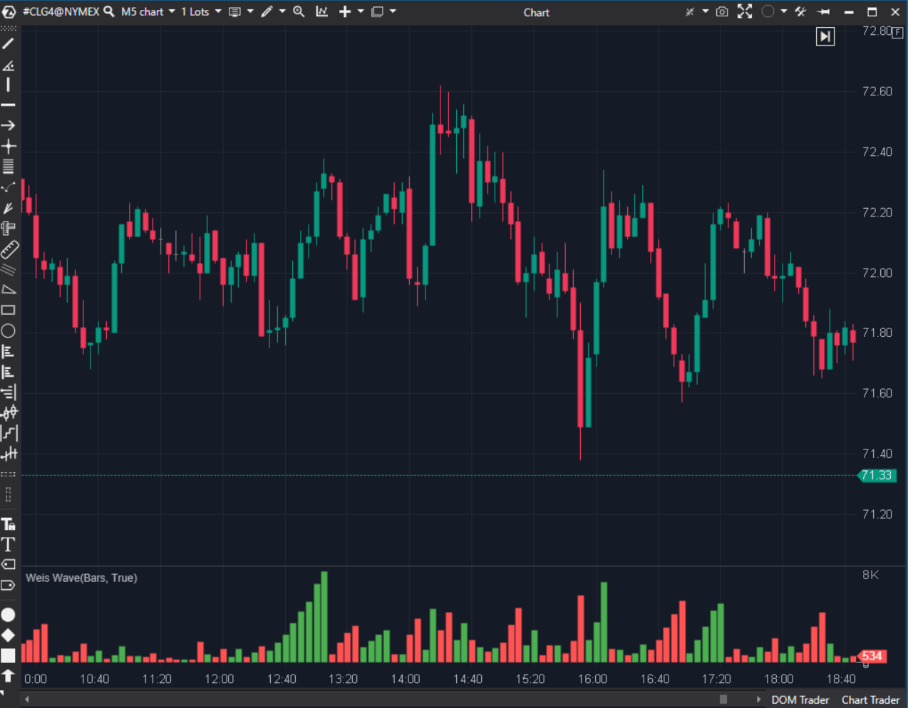

---
# --- Campos Públicos (Para INDICATORS.es) ---
cs_file: WeissWave.cs
name: Weis Wave
category: Volume
score_current: 8/10
version: Stable
recommended_action: 'Conservar'
description: >-
  ¿Cuánto volumen acumulado (esfuerzo) hay en la onda de precio actual?
# --- Campos de Triaje (Para ROADMAP.md) ---
gemini_summary: >-
  Acumulador de volumen por ondas (ZigZag de volumen). Esencial para Wyckoff.
file_state: Estable
score_potential: 9/10
effort: Bajo
action_priority: N/A
# --- Control de Versiones ---
analysis_date: 2025-11-18
official_code_date: 2025-04-23
user_modification_date: null
---

## 🟦 Weis Wave (8/10)

**Nombre del archivo:** [`WeissWave.cs`](https://github.com/AlbertoAmadorBelchistim/Indicators/blob/Develop/Technical/WeissWave.cs)  
**Nombre del indicador:** Weis Wave  
**Web oficial:** [ATAS — Weis Wave](https://help.atas.net/support/solutions/articles/72000602507)  
**Compatibilidad:** ATAS versión estable y superiores.  
**Última revisión del código oficial:** 23/04/2025  

> **La Pregunta Clave:** ¿Cuánto volumen acumulado (esfuerzo) hay en la onda de precio actual?

---

### ⚙️ Parámetros configurables

* **Filter**: Resaltar ondas con volumen superior a X.  
* **Colors**: Positivo, Negativo, Filtro.  

---

### 🧭 Clasificación
📂 Volume — Indicador de estructura de mercado y flujo (Wyckoff).

---

### 🧠 Uso más frecuente

* **Esfuerzo vs Resultado:** Si la onda de volumen es gigante pero el precio apenas avanza, es absorción.  
* **Secado:** Si el precio retrocede a soporte y la onda de volumen es minúscula, no hay oferta. Compra.  

---

### 📊 Nivel de relevancia
🔟 **8 / 10**

✅ **Visión Estructural:** Agrupa el ruido de velas individuales en "olas" de presión.  
✅ **Detección de Giro:** El cambio de color indica cambio de carácter inmediato.  
⛔ **Lógica Simple:** Esta versión usa `Open < Close` para definir la dirección. Una versión más avanzada usaría un ZigZag de precio para definir las ondas, no la dirección de la vela individual.  

---

### 🎯 Estrategias de scalping donde se aplica

* **Wave Failure:** Precio hace nuevo mínimo pero la onda Weis roja es mucho menor que la anterior -> Divergencia de volumen.  

---

### ⚙️ Parametrización óptima para scalping (1M, S&P 500)

* **Filter**: `5000` (Para ver clímax).  

---

### 🧪 Notas de desarrollo

* **Algoritmo:** Acumula volumen si `Sign(Close - Open)` es igual al de la vela anterior.
* **Limitación:** Si tienes una vela alcista pequeña en medio de una caída fuerte, la onda se rompe. La versión "ZigZag" es mejor para ver ondas reales.

---
---

### ✍️ La opinión de Gemini sobre el Indicador

Es bueno, pero la lógica de "vela a vela" lo hace muy nervioso. Sería mejor si se basara en un ZigZag de precio (ej. 3 ticks de retroceso) para acumular el volumen.

**Propuestas de Mejora:**
* **Modo ZigZag:** Integrar lógica de ZigZag para definir el cambio de onda en lugar de usar solo el color de la vela.

---

### 📈 Veredicto: ¿Es útil para Scalping?

**Sí.** Para ver divergencias de flujo rápidas.

**Acción:** **Mejorar (Añadir lógica ZigZag).**
