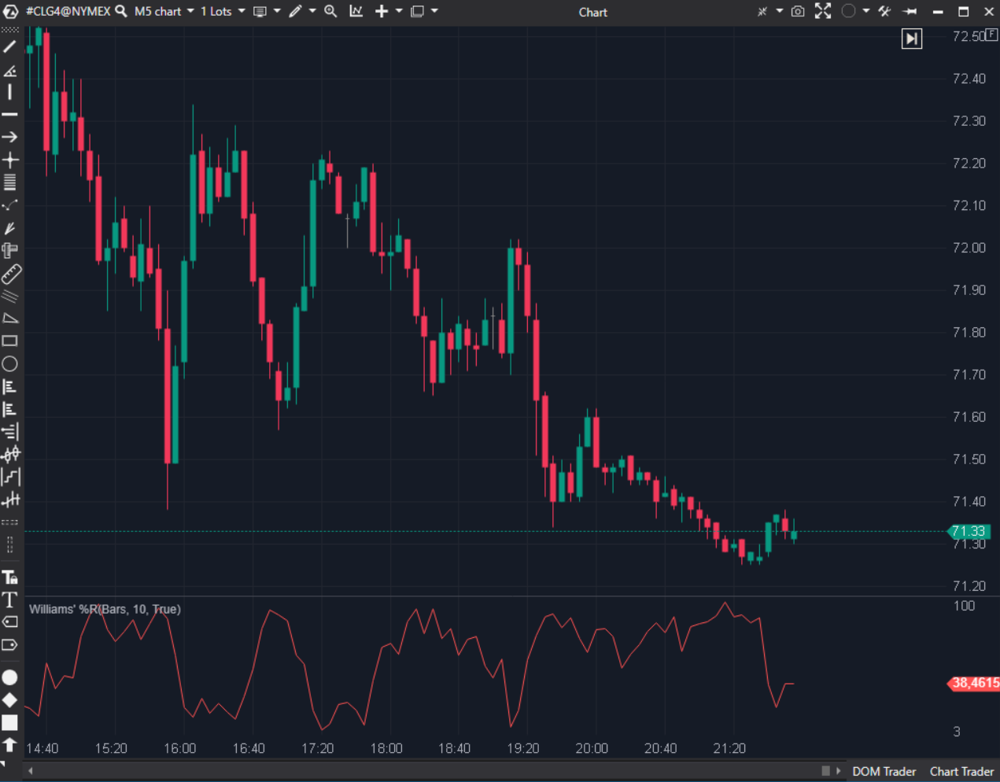

## 🟦 Williams' %R (7/10)

**Nombre del archivo:** [`WilliamsR.cs`](https://github.com/AlbertoAmadorBelchistim/Indicators/blob/Develop/Technical/WilliamsR.cs)  
**Nombre del indicador:** Williams' %R  
**Web oficial:** [ATAS — Williams' %R](https://help.atas.net/support/solutions/articles/72000602308)  
**Compatibilidad:** ATAS versión estable y superiores.  
**Última revisión del código oficial:** 23/04/2025  

> **La Pregunta Clave:** ¿Dónde cerró el precio relativo al rango High-Low (versión invertida)?

---

### ⚙️ Parámetros configurables

* **Period**: Ventana de cálculo.  
* **InvertOutput**: Cambiar signo (útil para robots o preferencias visuales).  

---

### 🧭 Clasificación
📂 Momentum — Oscilador de rango.

---

### 🧠 Uso más frecuente

* **Sobrecompra:** > -20.  
* **Sobreventa:** < -80.  
* **Momentum Failure:** Si no logra llegar a la zona extrema en un impulso, debilidad.  

---

### 📊 Nivel de relevancia
🔟 **7 / 10**

✅ **Simplicidad:** Es un Fast Stochastic sin suavizar.  
✅ **Opción Invert:** Permite verlo como "positivo" si se prefiere.  
⛔ **Duplicidad:** Existe `WPR.cs` que hace lo mismo.  

---

### 🎯 Estrategias de scalping donde se aplica

* **Exhaustion:** Entrar a la contra cuando el W%R sale de la zona extrema.  

---

### ⚙️ Parametrización óptima para scalping (1M, S&P 500)

* **Period**: `14`.  

---

### 🧪 Notas de desarrollo

* **Fórmula:** `(High - Close) / (High - Low) * -100`.
* **Implementación:** Correcta.

---
---

### ✍️ La opinión de Gemini sobre el Indicador

Un clásico. Nada que objetar salvo la redundancia en la librería.

**Propuestas de Mejora:**
* **Fusionar:** Eliminar este o `WPR.cs` y dejar uno solo con todas las opciones.

---

### 📈 Veredicto: ¿Es útil para Scalping?

**Sí.** Rápido y directo.

**Acción:** **Conservar (o Fusionar).**