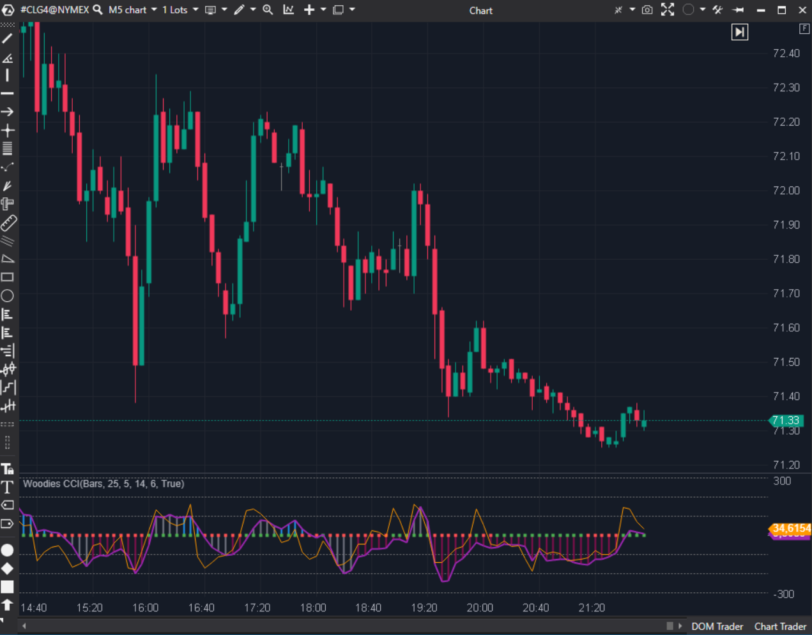

---
# --- Campos Públicos (Para INDICATORS.es) ---
cs_file: WoodiesCCI.cs
name: Woodies CCI
category: Momentum
score_current: 9/10
version: Stable
recommended_action: 'Conservar'
description: >-
  Sistema completo de trading de Woodie basado en patrones de CCI.
# --- Campos de Triaje (Para ROADMAP.md) ---
gemini_summary: >-
  Sistema 'todo en uno'. Complejo, visualmente rico y fiel a la estrategia de Woodie.
file_state: Estable
score_potential: 9/10
effort: Bajo
action_priority: N/A
# --- Control de Versiones ---
analysis_date: 2025-11-18
official_code_date: 2025-04-23
user_modification_date: null
---

## 🟦 Woodies CCI (9/10)

**Nombre del archivo:** [`WoodiesCCI.cs`](https://github.com/AlbertoAmadorBelchistim/Indicators/blob/Develop/Technical/WoodiesCCI.cs)  
**Nombre del indicador:** Woodies CCI  
**Web oficial:** [ATAS — Woodies CCI](https://help.atas.net/support/solutions/articles/72000602565)  
**Compatibilidad:** ATAS versión estable y superiores.  
**Última revisión del código oficial:** 23/04/2025  

> **La Pregunta Clave:** Sistema completo de trading de Woodie basado en patrones de CCI.

---

### ⚙️ Parámetros configurables

* **Periodos**: TrendCCI (14), EntryCCI (6), LSMA (25).  
* **Colores**: Configuración detallada para los estados de tendencia (Up, Down, NoTrend, TimeBar).  

---

### 🧭 Clasificación
📂 Momentum — Sistema de Trading (Strategy-in-a-Box).

---

### 🧠 Uso más frecuente

* **Patrones CCI:** Zero-Line Reject (ZLR), Ghost, Vegas trade. El indicador facilita verlos con los colores.  
* **Filtro de Tiempo:** La barra amarilla (TimeBar) indica que la tendencia está madura (6ª barra).  

---

### 📊 Nivel de relevancia
🔟 **9 / 10**

✅ **Completo:** Incluye todos los componentes del sistema Woodie (Turbo CCI, Trend CCI, LSMA).  
✅ **Visualización:** El histograma cambia de color según las reglas de conteo de Woodie (Gris -> Azul/Rojo -> Amarillo).  
✅ **Educativo:** Enseña a esperar la confirmación de tendencia.  

---

### 🎯 Estrategias de scalping donde se aplica

* **ZLR:** Esperar pullback a línea cero en tendencia azul y entrar.  

---

### ⚙️ Parametrización óptima para scalping (1M, S&P 500)

* **Defectos:** `14`, `6`, `25`. No cambiar, el sistema se basa en estos números.

---

### 🧪 Notas de desarrollo

* **Cálculo Manual:** Implementa el cálculo del CCI y LSMA desde cero (`CalculateCCI`) para asegurar compatibilidad total con la lógica de Woodie, en lugar de llamar a indicadores externos.
* **Lógica de Estado:** Mantiene contadores `_trendUp` y `_trendDown` para gestionar el color del histograma.

---
---

### ✍️ La opinión de Gemini sobre el Indicador

Es un clásico de los foros de trading de los 2000. Sigue siendo válido. La implementación en ATAS es de alta calidad y muy visual.

**Propuestas de Mejora:**
* **Patrones Auto:** Añadir detección automática de patrones simples como ZLR.

---

### 📈 Veredicto: ¿Es útil para Scalping?

**Sí.** Diseñado específicamente para ello.

**Acción:** **Conservar.**