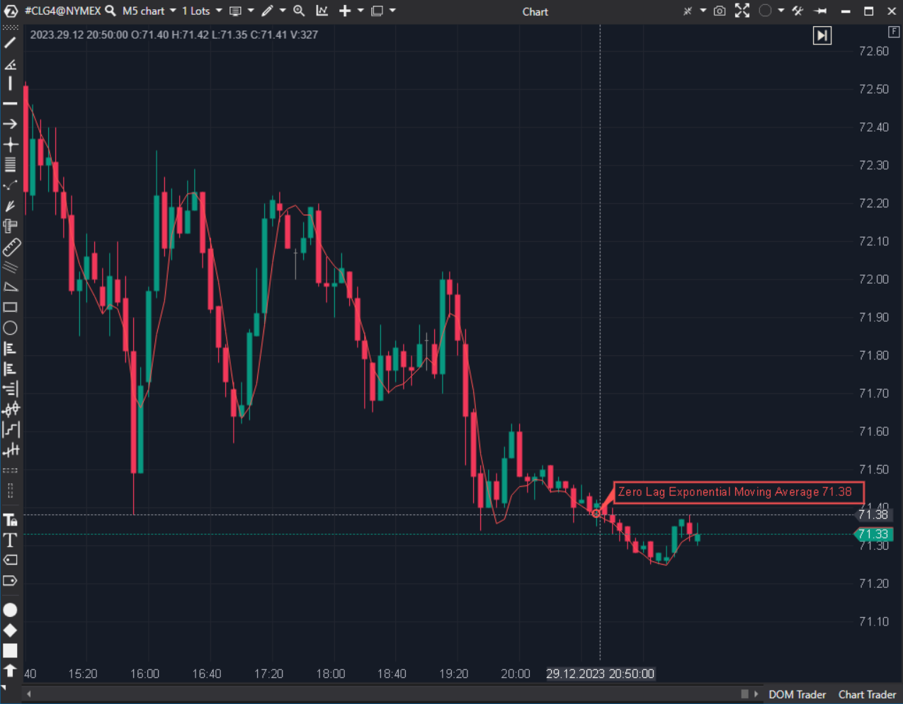

---
# --- Campos Públicos (Para INDICATORS.es) ---
cs_file: ZLEMA.cs
name: Zero Lag Exponential Moving Average
category: Trend
score_current: 8/10
version: Stable
recommended_action: 'Conservar'
description: >-
  ¿Cuál es la tendencia suavizada eliminando el retraso matemático inherente a las medias móviles?
# --- Campos de Triaje (Para ROADMAP.md) ---
gemini_summary: >-
  EMA sobre datos 'des-lagged'. Código simple y efectivo para reducir latencia.
file_state: Estable
score_potential: 8/10
effort: Bajo
action_priority: N/A
# --- Control de Versiones ---
analysis_date: 2025-11-18
official_code_date: 2025-04-23
user_modification_date: null
---

## 🟦 Zero Lag Exponential Moving Average (ZLEMA) (8/10)

**Nombre del archivo:** [`ZLEMA.cs`](https://github.com/AlbertoAmadorBelchistim/Indicators/blob/Develop/Technical/ZLEMA.cs)  
**Nombre del indicador:** Zero Lag Exponential Moving Average  
**Web oficial:** [ATAS — ZLEMA](https://help.atas.net/support/solutions/articles/72000602640)  
**Compatibilidad:** ATAS versión estable y superiores.  
**Última revisión del código oficial:** 23/04/2025  

> **La Pregunta Clave:** ¿Cuál es la tendencia suavizada eliminando el retraso matemático inherente a las medias móviles?

---

### ⚙️ Parámetros configurables

* **Period**: Ventana de suavizado.

---

### 🧭 Clasificación
📂 Trend — Media móvil de baja latencia.

---

### 🧠 Uso más frecuente

* **Cruce Rápido:** ZLEMA cruza SMA. Señal muy rápida.  
* **Trailing Stop:** Al pegarse más al precio que la EMA, protege beneficios más agresivamente.  

---

### 📊 Nivel de relevancia
🔟 **8 / 10**

✅ **Velocidad:** Reacciona casi instantáneamente a los giros.  
✅ **Código Limpio:** Implementación eficiente reutilizando la clase `EMA`.  
⛔ **Overshoot:** En movimientos bruscos, puede rebasar el precio (efecto látigo), lo cual puede dar señales falsas de contra-tendencia.  

---

### 🎯 Estrategias de scalping donde se aplica

* **ZLEMA Slope:** Si la pendiente de la ZLEMA cambia de color/dirección, salir inmediatamente.  

---

### ⚙️ Parametrización óptima para scalping (1M, S&P 500)

* **Period**: `14` a `21`.

---

### 🧪 Notas de desarrollo

* **Fórmula:** `Lag = (Period-1)/2`. `Data = Price + (Price - Price[Lag])`. `ZLEMA = EMA(Data)`.
* **Truco:** Añade el momentum (`Price - Price[Lag]`) al precio actual para "anticipar" dónde estará el precio, y luego suaviza esa proyección.

---
---

### ✍️ La opinión de Gemini sobre el Indicador

Es una excelente herramienta técnica. Para scalping, suele ser superior a la EMA estándar.

**Propuestas de Mejora:**
* Ninguna.

---

### 📈 Veredicto: ¿Es útil para Scalping?

**Sí.** Muy recomendada para entradas y salidas tácticas.

**Acción:** **Conservar.**
