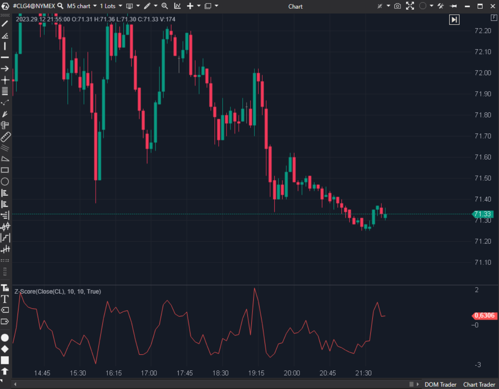

---
# --- Campos Públicos (Para INDICATORS.es) ---
cs_file: ZScore.cs
name: Z-Score
category: Statistical
score_current: 8/10
version: Stable
recommended_action: Conservar
description: ¿A cuántas desviaciones estándar se encuentra el precio actual de su media histórica?
# --- Campos de Triaje (Para ROADMAP.md) ---
gemini_summary: "Indicador estadístico estándar. Implementación correcta de la fórmula Z-Score."
file_state: Estable
score_potential: 8/10
effort: Bajo
action_priority: N/A
# --- Control de Versiones ---
analysis_date: 2025-11-18
official_code_date: 2025-04-23
user_modification_date: null
---

## 🟦 Z-Score (8/10)

**Nombre del archivo:** [`ZScore.cs`](https://github.com/AlbertoAmadorBelchistim/Indicators/blob/Develop/Technical/ZScore.cs)  
**Nombre del indicador:** Z-Score  
**Web oficial:** [ATAS — Z-Score](https://help.atas.net/support/solutions/articles/72000602269)  
**Compatibilidad:** ATAS versión estable y superiores.  
**Última revisión del código oficial:** 23/04/2025  

> **La Pregunta Clave:** ¿A cuántas desviaciones estándar se encuentra el precio actual de su media histórica?

---

### ⚙️ Parámetros configurables

* **SmaPeriod**: Ventana para la media.  
* **StdPeriod**: Ventana para la desviación estándar (usualmente igual a la media).  

---

### 🧭 Clasificación
📂 Statistical — Oscilador de reversión a la media (Mean Reversion).

---

### 🧠 Uso más frecuente

* **Sobrecompra Estadística:** Z > 2.0 (2 Sigmas). Probabilidad de reversión del 95%.  
* **Sobreventa Estadística:** Z < -2.0.  
* **Pairs Trading:** Usar el Z-Score del spread entre dos activos para operar la convergencia.  

---

### 📊 Nivel de relevancia
🔟 **8 / 10**

✅ **Objetividad:** Elimina la subjetividad de "está caro/barato". Lo cuantifica en Sigmas.  
✅ **Universal:** Funciona igual en cualquier activo o timeframe.  
⛔ **Tendencias Fuertes:** En un crash o rally parabólico, el Z-Score puede mantenerse en >3 durante mucho tiempo (la "irracionalidad" del mercado).  

---

### 🎯 Estrategias de scalping donde se aplica

* **Rubber Band:** Vender en +2.5 Sigma, cerrar en +1 Sigma.  

---

### ⚙️ Parametrización óptima para scalping (1M, S&P 500)

* **Period**: `20`.  

---

### 🧪 Notas de desarrollo

* **Fórmula:** `(Price - SMA) / StdDev`.
* **Código:** Correcto. Protege contra división por cero (`_stdDev[bar] != 0`).

---
---

### ✍️ La opinión de Gemini sobre el Indicador

Es una herramienta esencial para traders cuantitativos y de reversión a la media.

**Propuestas de Mejora:**
* **Bandas:** Dibujar líneas en +2, -2, 0 por defecto.

---

### 📈 Veredicto: ¿Es útil para Scalping?

**Sí.** Para detectar excesos insostenibles.

**Acción:** **Conservar.**
