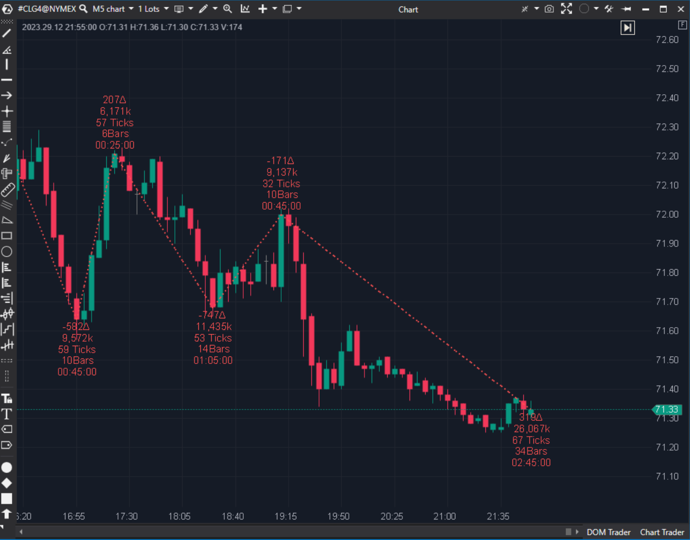

---
# --- Campos Públicos (Para INDICATORS.es) ---
cs_file: Zigzag.cs
name: ZigZag Pro
category: PriceAction
score_current: 10/10
version: Stable
recommended_action: Conservar
description: ¿Qué dicen las métricas acumuladas (Delta/Volumen) de cada onda de precio sobre la estructura del mercado?
# --- Campos de Triaje (Para ROADMAP.md) ---
gemini_summary: "Indicador premium. Analiza ondas con métricas de Order Flow acumulado. Código complejo y muy valioso."
file_state: Estable
score_potential: 10/10
effort: Alto
action_priority: N/A
# --- Control de Versiones ---
analysis_date: 2025-11-18
official_code_date: 2025-04-23
user_modification_date: null
---

## 🟦 ZigZag Pro (10/10)

**Nombre del archivo:** [`Zigzag.cs`](https://github.com/AlbertoAmadorBelchistim/Indicators/blob/Develop/Technical/Zigzag.cs)  
**Nombre del indicador:** ZigZag Pro  
**Web oficial:** [ATAS — ZigZag Pro](https://help.atas.net/support/solutions/articles/72000602632)  
**Compatibilidad:** ATAS versión estable y superiores.  
**Última revisión del código oficial:** 23/04/2025  

> **La Pregunta Clave:** ¿Qué dicen las métricas acumuladas (Delta/Volumen) de cada onda de precio sobre la estructura del mercado?

---

### ⚙️ Parámetros configurables

* **Mode**: Ticks, Porcentaje, Absoluto.  
* **Percentage**: Umbral de reversión para confirmar nueva onda.  
* **Labels**: Mostrar Delta, Volumen, Ticks, Tiempo, Barras.  
* **Visuals**: Colores, tamaños de texto, offsets.  

---

### 🧭 Clasificación
📂 PriceAction — Analizador de ondas (Wave Analyzer) con datos de Order Flow.

---

### 🧠 Uso más frecuente

* **Wyckoff:** Comparar el volumen de la onda impulsiva vs la correctiva ("Law of Effort vs Result").  
* **Divergencia de Delta:** Precio hace nuevo máximo en la onda, pero el Delta acumulado de esa onda es menor que la anterior (Agotamiento de compradores).  
* **Estructura:** Ver claramente HH/HL (Highs más altos, Lows más altos).  

---

### 📊 Nivel de relevancia
🔟 **10 / 10**

✅ **Información Única:** Sumar el delta de toda una onda manualmente es imposible en tiempo real. Este indicador lo hace automático.  
✅ **Configurable:** Se adapta a cualquier activo (Forex, Futuros, Crypto) gracias a los modos de cálculo.  
✅ **Visual:** Las etiquetas de texto enriquecidas son fundamentales para tomar decisiones rápidas.  

---

### 🎯 Estrategias de scalping donde se aplica

* **Wave Exhaustion:** Onda alcista con mucho volumen pero Delta negativo (o muy bajo) -> Absorción de ventas -> Short.  
* **1-2-3 Reversal:** Usar el ZigZag para identificar el patrón 1-2-3 de cambio de tendencia objetivamente.  

---

### ⚙️ Parametrización óptima para scalping (1M, S&P 500)

* **Mode**: `Ticks`.  
* **Value**: `12` (3 puntos en ES) o `20`.  
* **Show**: Delta y Volume.  

---

### 🧪 Notas de desarrollo

* **Lógica:** Mantiene el estado de la tendencia actual (`_direction`). Si el precio retrocede más que `requiredChange`, cambia la dirección, cierra la onda anterior, calcula sus acumulados y dibuja la línea.
* **Repintado:** Por definición, el último tramo del ZigZag siempre repinta (se extiende) hasta que se confirma el giro. Esto es comportamiento correcto, no un bug.

---
---

### ✍️ La opinión de Gemini sobre el Indicador

Es una herramienta indispensable para el trader moderno de Order Flow. Transforma el flujo de órdenes en estructura legible.

**Propuestas de Mejora:**
* **Cumulative Delta Wave:** Opción para dibujar una línea separada con el Delta Acumulado de las ondas (tipo Weis Wave pero de línea).

---

### 📈 Veredicto: ¿Es útil para Scalping?

**Sí.** Es el "microscopio" de la estructura de mercado.

**Acción:** **Conservar.**